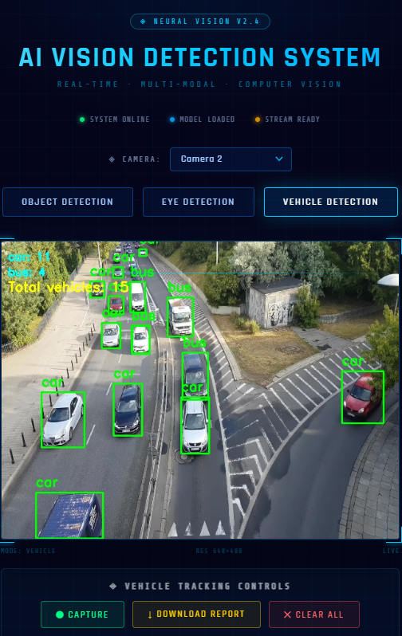
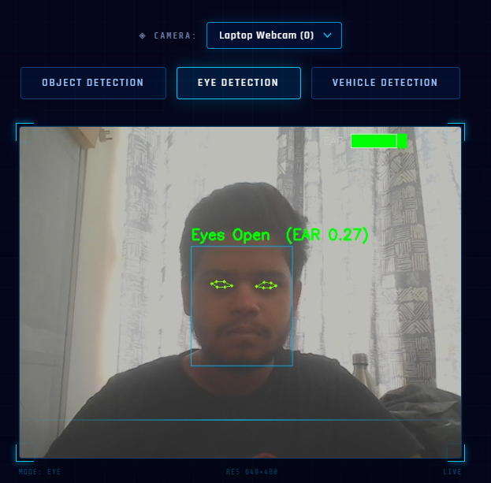
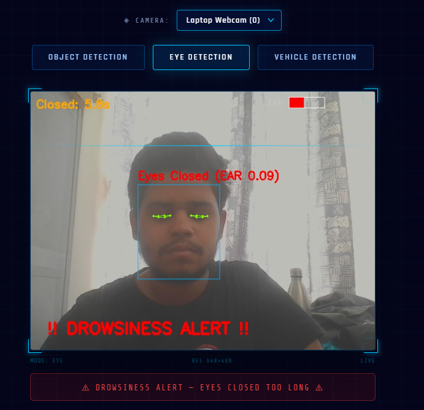

#  AI Real-Time Vision Detection System (YOLOv8 + OpenCV)

An **AI-based real-time computer vision system** built using **Python, OpenCV, YOLOv8, and Flask**.

The system detects:

- Objects
- Vehicles (with tracking, counting, and reporting)
- Human Eye State (with drowsiness alerts)

A **Flask web interface** allows switching between detection modes, toggling camera sources, and displays the **live webcam feed with AI detection results**.

---

#  Features

✔ **Real-time Object Detection** using YOLOv8  
✔ **Vehicle Detection & Counting** (Includes Capture, Logs, and Report Download)  
✔ **Eye Drowsiness Detection** (with visual alerts and audio buzzer)  
✔ **Multi-Camera Source Selection** (Toggle between Laptop, OBS Virtual Cam, etc.)  
✔ **Live webcam streaming** in browser with a dynamic UI  
✔ **Flask Web Backend** for seamless operation  

---

#  Technologies Used

- Python
- OpenCV
- YOLOv8 (Ultralytics)
- Flask
- HTML / CSS
- JavaScript

---

#  Frontend Interface


---


## Vehicle Detection

Tracks and counts vehicles in real-time. The UI features a control panel to capture current vehicle counts, view capture logs, and download a detailed vehicle detection report (TXT).



---

## Eye Detection

Monitors human eye state and triggers a drowsiness alert banner with an audio buzzer if eyes remain closed for an extended period.

| OPEN EYES | CLOSED EYES |
|--------------------|--------------------|
|  |  |

---

## Multi-Camera Support

Switch dynamically between different camera sources (e.g., Laptop Webcam, OBS Virtual Camera) directly from the web interface without reloading the stream.

---

Run This To install libraries in your environment  - 
-
```shell
pip install -r requirements.txt

```
## GPU Support

The project supports GPU acceleration using CUDA.

Recommended setup:

Python 3.11  
CUDA 11.8  
PyTorch with CUDA support
Install PyTorch with CUDA:
```shell
pip install torch torchvision torchaudio --index-url https://download.pytorch.org/whl/cu118
```


# 📥 Download Project from GitHub

Clone the repository to your system:

```bash
git clone https://github.com/HanshuPandhare/yolov8-opencv-computer-vision-system.git
cd yolov8-opencv-computer-vision-system
```
