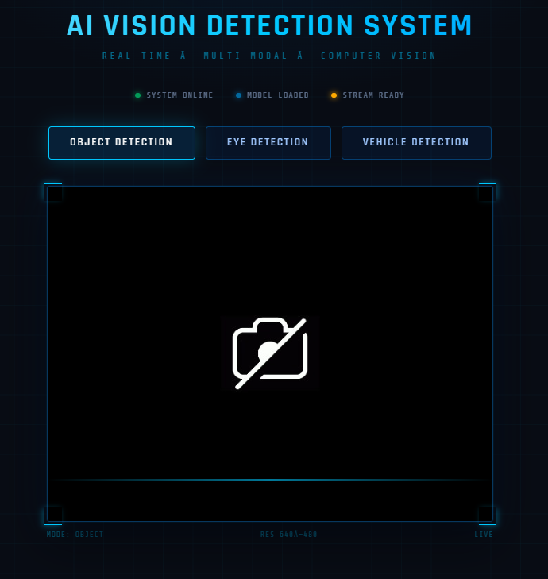
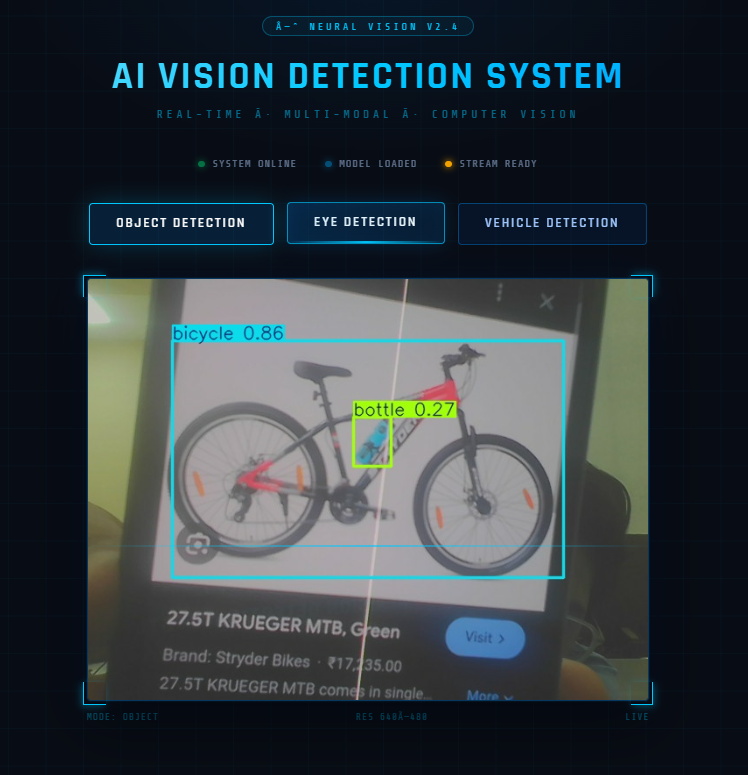
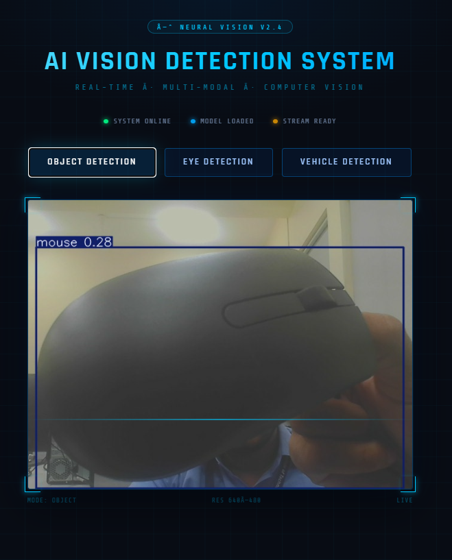
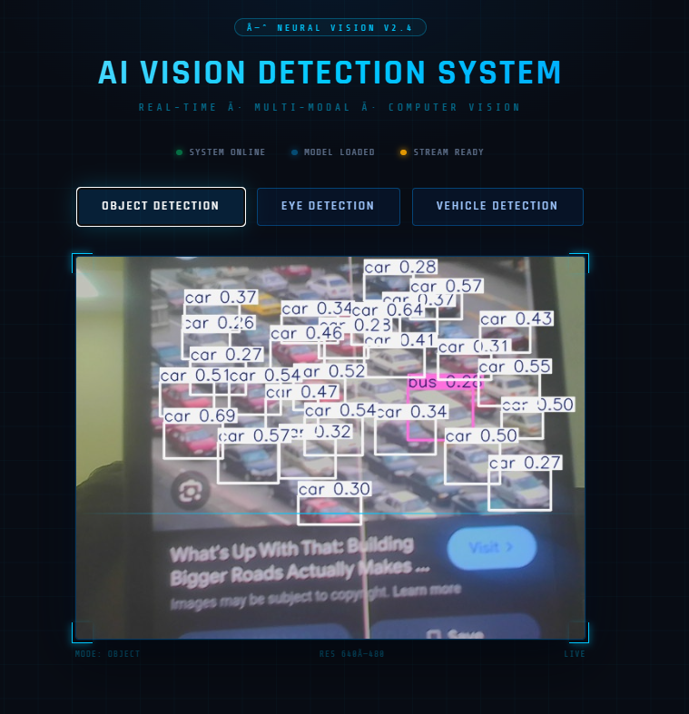
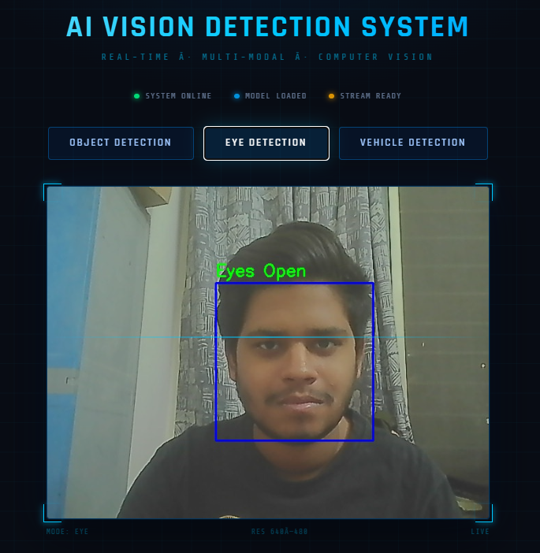
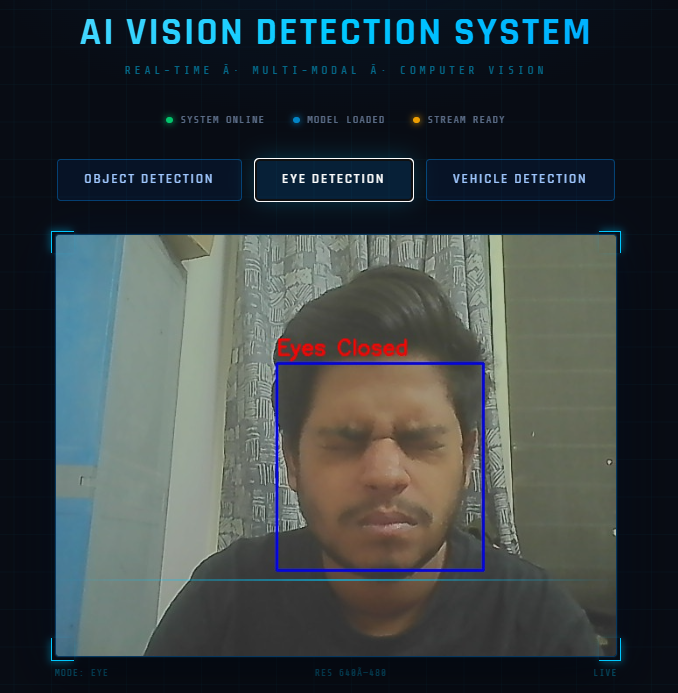

# 🔍 AI Real-Time Vision Detection System (YOLOv8 + OpenCV)

An **AI-based real-time computer vision system** built using **Python, OpenCV, YOLOv8, and Flask**.

The system detects:

- Objects
- Vehicles
- Human Eye State

A **Flask web interface** allows switching between detection modes and displays the **live webcam feed with AI detection results**.

---

# 🚀 Features

✔ Real-time Object Detection  
✔ Vehicle Detection  
✔ Eye Detection using OpenCV  
✔ YOLOv8 deep learning model  
✔ Live webcam streaming in browser  
✔ Simple web interface using Flask  

---

# 🛠 Technologies Used

- Python
- OpenCV
- YOLOv8 (Ultralytics)
- Flask
- HTML / CSS
- JavaScript

---

# 📸 Frontend Interface



---

## 📸 Object Detection

| Detection Result 1 | Detection Result 2 |
|--------------------|--------------------|
|  |  |

---

## Vehicle Detection



---

## Eye Detection
| OPEN EYES | CLOSED EYES |
|--------------------|--------------------|
|  |  |

---

Run This To install libraries in your environment  - 
-
```shell
pip install -r requirements.txt

```
## GPU Support

The project supports GPU acceleration using CUDA.

Recommended setup:

Python 3.11  
CUDA 11.8  
PyTorch with CUDA support
Install PyTorch with CUDA:
```shell
pip install torch torchvision torchaudio --index-url https://download.pytorch.org/whl/cu118


# 📥 Download Project from GitHub

Clone the repository to your system:

```bash
git clone https://github.com/HanshuPandhare/yolov8-opencv-computer-vision-system.git
cd yolov8-opencv-computer-vision-system
```
